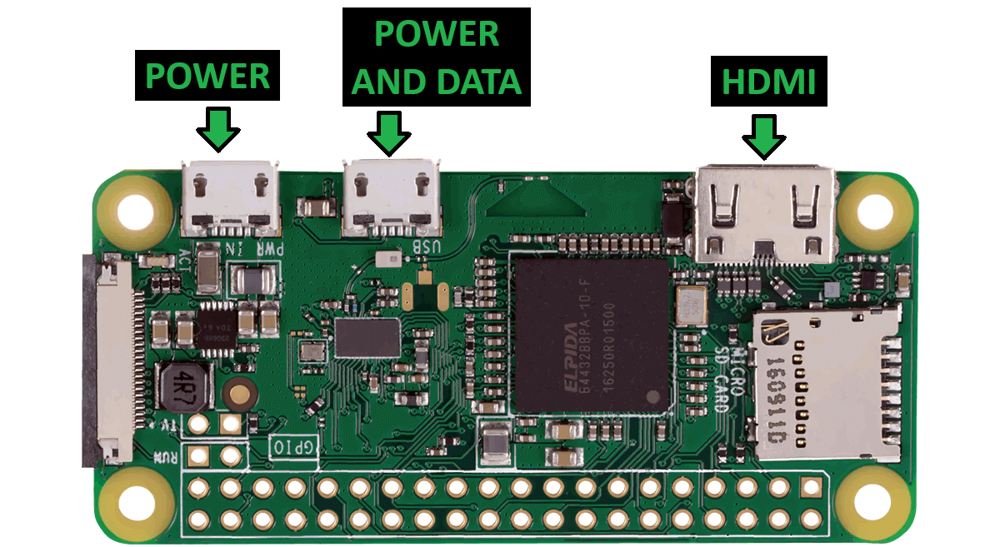

# Pwnagotchi from Zero to Hero

## Caution note

### Rememebr this without knowing what you trying to do and without proper limiting attack functionality you will attack all the networks by this device. You will break the law by using it like this . breaking to the network or making disruption to the network that you dont have permission to attack you are breaking the law. Ignorance will not justify you.

## Description

This extensive ocumentation contains all the steps to create the Pwnagotchi with all the steps:
- donwload pwnagotchi image
- create sd card
- configure windows
- configure phone
- install hashcat
- 

## BOM - Bill of material

As we need some hardware to play with [follow this link](./docs/hardware/README.md)

## Installing 

1. Download Pwnagotchi image [follow this link](./docs/download_image/README.md)
2. Create the SD card [follow this link](./docs/sd/README.md)
3. Insert this SD card to pawnagotchi.
4. connect usb cable to your computer and insert to the second micro usb port for the data 
5. install the drivers for the connection (only first time) [follow this link](./docs/windows_usb_drivers/README.md)