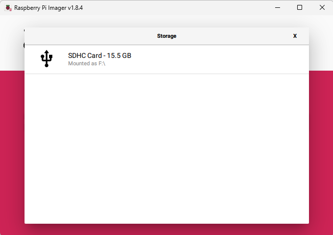

# Creating SD card in Windows

## Description

This process 

## Steps

1. Download and install Raspberry Pi Imager [here](https://downloads.raspberrypi.org/imager/imager_latest.exe) 
2. Open Raspberry Pi Imager you should see something like this this is our `Welcome Screen` 
3. We need to `choose device` and we should see this list 
4. From this list we need to select `Raspberry PI Zero 2W`
5. Next is to choose the `Operating System` from the `Welcome Screen` 
6. From that list we need to select `Use custom` from the bottom of the list and please select the image you downloaded for the Pwnagotchi
7. Once selected now please click on `Choose Storage` from the `Welcome Screen`  
8. Please select SD card where you like to have the Pwnagochi system to written.
9. From the main menu Please click `Next`
10. When `Use OS customisation` will show please click on `EDIT SETTINGS` 
11. Please set few values
  - `hostname` - This should be setup as friendly name [letters and numbers only]
  - `username` - this is the name of the user that you will use login to the device
  - `password` - this is the password that you will use to in login process
  - `set locale settting` - to set your timezone 
12. Once the values are set please press `save`
13. when return back to the `Use OS customisation` this time please press `Yes`.
14. you will be presented with the confirmation screen please validate if this is the drive that you like to erase (all data will be lost on that drive) . Please press `Yes` 
15. writing to the sd card will begin  fallowing the validation 
16. once the process will finish you should see this message 
