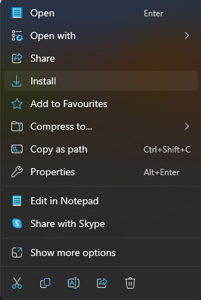
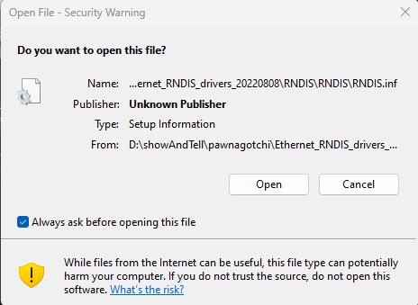
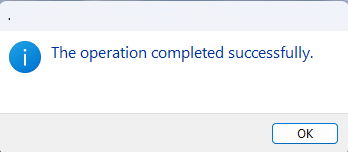
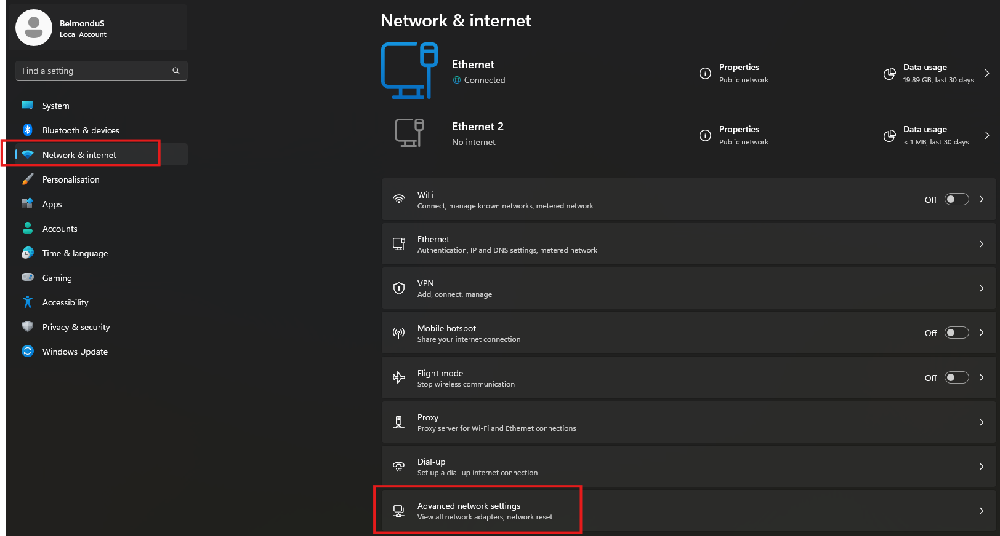
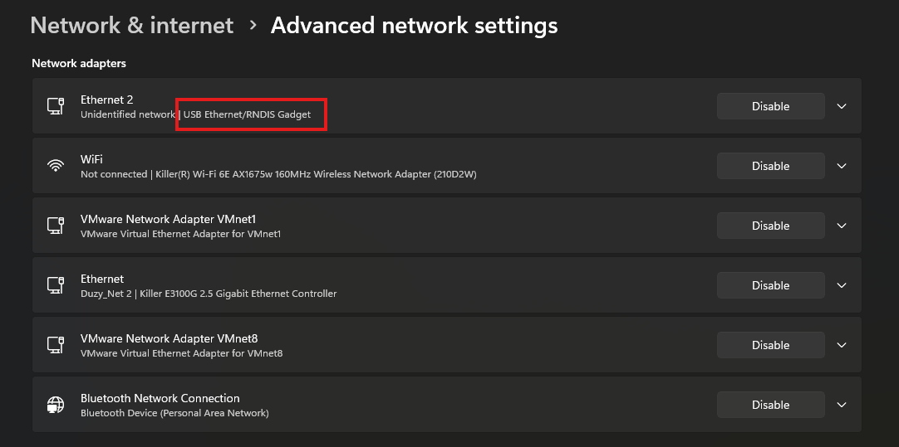
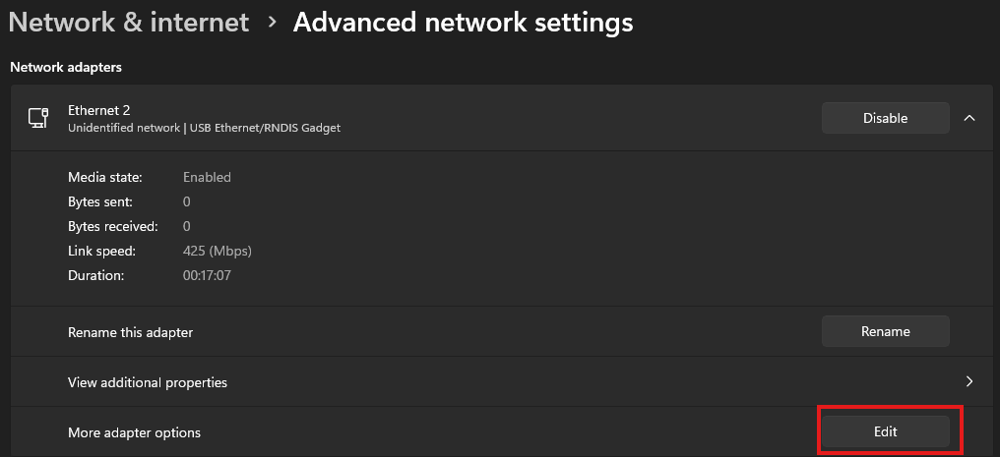
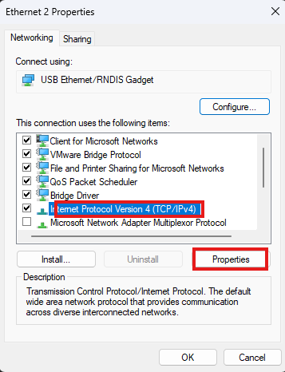
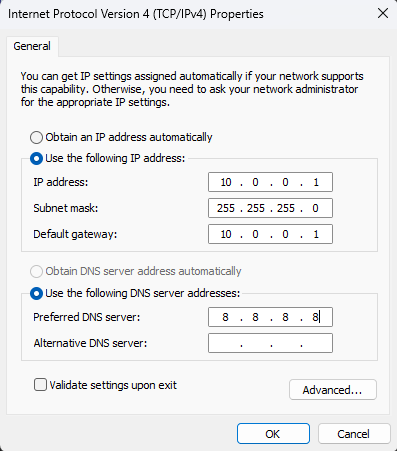

# Installing windows USB network drivers

## Description

Step by step how to install and configure IP for the raspberry pi zero connected to the computer by USB cable

## Steps

1. Download the to your computer. 
2. From the folder `drivers/RNDIS` please right click on the file `RNDIS.inf`
3. Please press `Install` 
4. you will be ask to confirm opening the file. Please press `Open` 
5. after few seconds you will have message confirming installation. 
6. Next step is to restart the computer
7. once the computer will be restarted, please connect Pwnagotchi and open settings (windows 11).
8. From left meny Please select `Network & internet` and from righ side please click on `Advanced network settings` 
9. Once you presented with the list of network cards please click on the one that says `USB Ethernet/RNDIS Gadget` 
10. When more options will be show please click on `Edit` on the line `More adapter options` 
11. On new window please select `Internet Protocol Version 4 (TCP/IPv4)` once selected please click on `Properties` 
12. When presented with new window please fill exactly this information to the fields bellow. 
  - IP address - `10.0.0.1`
  - Subnet mask - `255.255.255.0`
  - Default gateway - `10.0.0.1`
  - Preferred DNS server - `8.8.8.8`
13. Once information is filled please press `OK` on current and on previews window as well.
14. This conclude setup of network interface for the USB cable and drivers